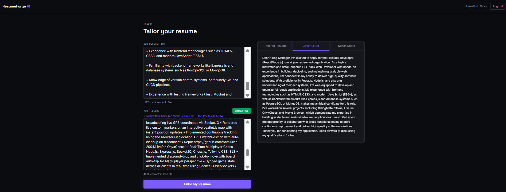

<div align="center">

# 📄 ResumeForge AI - AI Resume Tailoring Tool

**An AI-powered resume tailoring web app that rewrites your resume and generates a matching cover letter for any job description, built with Next.js, TypeScript, PostgreSQL, and Groq AI.**

[](https://nextjs.org)
[](https://www.typescriptlang.org)
[](https://supabase.com)
[](https://prisma.io)
[](https://tailwindcss.com)
[](https://groq.com)

</div>

---

## 📸 Preview

> *Dark-themed AI tool: paste a job description, upload a resume, get a tailored result*



---

## ✨ Features

- 🔐 **JWT Authentication**, secure register & login with bcrypt password hashing and httpOnly cookies (not localStorage)
- 🛡️ **Route Protection**, Next.js `proxy` file blocks unauthenticated access to protected pages at the routing layer, before they render
- 📄 **PDF Resume Upload**, extracts resume text directly from an uploaded PDF using `unpdf`, no manual copy-pasting required
- 🤖 **AI-Powered Tailoring**, sends resume + job description to Groq's `llama-3.3-70b-versatile` model, returns a rewritten summary, skills, and experience bullets emphasizing what's relevant to that job
- ✉️ **Cover Letter Generation**, a complete, tailored cover letter generated alongside the resume rewrite
- 📊 **Dual Match Scoring**, an AI-estimated match score shown alongside a separate, deterministic keyword-overlap score calculated without AI
- 🎨 **Custom Dark Design System**, self-hosted fonts (Space Grotesk, Inter, JetBrains Mono) via `next/font`, with a signature "diff-mark" motif (highlighted/struck-through text) that visually echoes what the product does: editing and rewriting
- 📱 **Fully Responsive**, works across mobile, tablet, and desktop
- ☁️ **Cloud Database**, PostgreSQL hosted on Supabase with Prisma ORM

---

## 🚀 Live Demo

**[View ResumeForge AI](https://resumeforge-puce.vercel.app/)**

---

## 🗂️ Project Structure

```text
ResumeForge/
│
├── src/
│   ├── app/
│   │   ├── page.tsx                  # Landing page
│   │   ├── login/page.tsx            # Login page
│   │   ├── register/page.tsx         # Register page
│   │   ├── dashboard/page.tsx        # User dashboard (server component)
│   │   ├── tailor/page.tsx           # Main AI tool, upload + tailor UI
│   │   ├── globals.css               # Design tokens (CSS variables)
│   │   ├── layout.tsx                # Root layout, font loading
│   │   └── api/
│   │       ├── auth/
│   │       │   ├── register/route.ts # Create user, hash password, issue JWT
│   │       │   ├── login/route.ts    # Verify password, issue JWT
│   │       │   ├── logout/route.ts   # Clear auth cookie
│   │       │   └── me/route.ts       # Return current authenticated user
│   │       ├── tailor/route.ts       # Calls Groq, returns tailored result
│   │       └── parse-resume/route.ts # Extracts text from uploaded PDF
│   │
│   ├── components/
│   │   └── Navbar.tsx                # Shared nav for protected pages
│   │
│   ├── lib/
│   │   ├── prisma.ts                 # Prisma client singleton
│   │   ├── jwt.ts                    # JWT sign/verify (Node runtime)
│   │   ├── jwt-edge.ts               # JWT verify (Edge-compatible, via jose)
│   │   ├── auth-cookie.ts            # httpOnly cookie helpers
│   │   ├── validation.ts             # Zod schemas
│   │   ├── groq.ts                   # Groq API integration
│   │   └── match-score.ts            # Non-AI keyword overlap calculator
│   │
│   └── proxy.ts                      # Route protection (Next.js 16 middleware)
│
└── prisma/
    └── schema.prisma                 # Database schema
```

---

## 🏁 Getting Started

```bash
# 1. Clone the repository
git clone https://github.com/Samiullah-2004/ResumeForge.git

# 2. Navigate into the project
cd ResumeForge

# 3. Install dependencies
npm install

# 4. Set up environment variables
cp .env.example .env
# Fill in .env with:
# DATABASE_URL=your_supabase_pooler_url
# DIRECT_URL=your_supabase_direct_url
# JWT_SECRET=your_random_secret (generate with: openssl rand -base64 32)
# GROQ_API_KEY=your_free_groq_key

# 5. Push database schema
npx prisma generate
npx prisma db push

# 6. Run the dev server
npm run dev
```

Then open [http://localhost:3000](http://localhost:3000) in your browser.

---

## 🛠️ Tech Stack

| Technology | Purpose |
|---|---|
| **Next.js (App Router)** | Full-stack framework, frontend pages and backend API routes in one project |
| **TypeScript** | Type safety across frontend and backend |
| **Tailwind CSS** | Utility-first responsive styling |
| **React Hook Form + Zod** | Form handling and schema validation |
| **PostgreSQL + Supabase** | Cloud-hosted relational database |
| **Prisma ORM** | Type-safe database queries and migrations |
| **JWT + bcryptjs** | Authentication and password security |
| **jose** | Edge-runtime-compatible JWT verification (used in `proxy.ts`) |
| **Groq API** | LLM inference (`llama-3.3-70b-versatile`) for resume tailoring |
| **unpdf** | Serverless-friendly PDF text extraction |
| **next/font** | Self-hosted, optimized font loading |

---

## 🔌 API Endpoints

POST   /api/auth/register       Create new account

POST   /api/auth/login          Login and receive JWT

POST   /api/auth/logout         Clear auth cookie

GET    /api/auth/me             Get current authenticated user
POST   /api/parse-resume        Extract text from an uploaded PDF resume

POST   /api/tailor              Generate tailored resume, cover letter, and match score

---

## 🤖 AI Integration

The `/api/tailor` route sends the candidate's resume text and the target job description to Groq's `llama-3.3-70b-versatile` model via direct REST call (no SDK dependency, avoiding version-drift issues). The request uses `response_format: { type: "json_object" }` to force structured, parseable output: a summary, skills list, rewritten experience bullets, and a full cover letter, rather than freeform text that would need fragile parsing. Alongside the AI-estimated match score, a separate deterministic score is calculated locally via keyword overlap between the resume and job description, giving a non-AI sanity check on the same page.

---

## 🚢 Deployment

- **Frontend + Backend**, deployed together on **Vercel** (Next.js API routes run as serverless functions)
- **Database**, **Supabase** PostgreSQL

Environment variables required on Vercel:
- `DATABASE_URL`
- `DIRECT_URL`
- `JWT_SECRET`
- `GROQ_API_KEY`

---

## 👤 Author

**Samiullah Akram**
Full Stack MERN Developer from Lahore, Pakistan 🇵🇰

[](https://github.com/Samiullah-2004)
[](https://www.linkedin.com/in/samiullah-akram-a28461404/)
[](https://instagram.com/_s_a_m_i_u_l_l_a_h_)
[](mailto:samiullah.akram.3009@gmail.com)

---

## 📄 License

This project is open source and free to use for personal and educational purposes.
If you use this as a reference or template, a credit would be appreciated! 🙏

---

<div align="center">

**Built with 💜 by Samiullah, 2026**

</div>